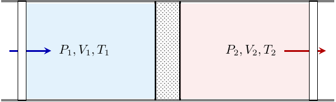

# 宏观热力学量与 Gibbs 分布

“宏观**热力学量**” 事实上是一个同语反复（**tautologos*），因为只有宏观量才能为我们所测量。本章的目标是：介绍常见的热力学量，并指出他们与 Gibbs 分布的参量之间的关系。我们已经知道了更一般的情况，就是粒子数可以变化（由化学势支配）的情况，让我们把这些情况也考虑在内。

{  本节采取略差异于俄派的记法，对于欧美派的记法比较可见下表.}

| 本稿记法及命名 | Landau \& Lifschitz | Kardar |
| --- | --- | --- |
| $E$ 内能 | $E$ 内能 | $U$ 内能 |
| $W$ 焓 | $W$ 焓 | $H$ 焓 |
| $F$ 自由能 | $F$ 自由能 | $F$ Helmholtz 自由能 |
| $$ Gibbs 函数 | $$ 热力学势 | $G$ Gibbs 自由能 |
| $$ 热力学势 | $$ “另一种”热力学势 | $$ 巨势 |

## 内能

我们已经知道，在系统与外界不发生宏观的相互作用时，我们可以写出下式：

$$
dE = -TdS + \sum_i\mu_idN_i.
$$

上式中已经计及多种粒子所具有的不同化学势。其中 $E$ 不是指物体的全部能量，而是在一个物体既不平动，也不转动的参考系中，系统的能量。（在转动参考系中，等效势能计入 $E.$） 这里的假设是物体的运动是经典的。
这个式子的物理意义是：当没有宏观的相互作用时，物体与外界仅可通过传热和交换粒子传递相互作用。

### 准静态、可逆过程与元功

现在想要知道当外界条件发生变化时，物体的内能将会发生怎样的变化。
为了不破坏平衡态，我们认为引入相互作用的过程是如此的慢，以至于它在力学上可以使用准静态过程（对于力学量 $\lambda$ 来说，这要求 $\frac{d\lambda}{dt}\ll 1$ ）描述。但是若我们在引入相互作用时使熵 $S$ 和粒子数 $N$ 发生了改变，那么内能的形式将会难以写出。所以在这里我们只研究粒子数不变的可逆过程（ $S$ 不变）。

在引入相互作用时，我们可以将熵随时间的变化 $d_t S$ 展成力学参量变化 $d_t \lambda$ 的级数，并假定这是引起熵变化的唯一来源（稍后将解释其中原因）。 由于平衡态的假设和熵增原理，我们可以知道领头阶的项是二阶的。于是：

$$
\frac{d S}{d t} = A \left( \frac{d \lambda}{d t} \right)^2.
$$

这就得到

$$
\frac{d S}{d \lambda} = A \frac{d \lambda}{d t}.
$$

这意味着只要 $d_t \lambda$ 趋于零，$S$ 就与 $\lambda$ 无关。这就是说，在一般情况下，当 $\lambda$ 的变化不引起其他使熵增大的改变（没有耗散或泄流），那么**可逆过程和准静态过程是等价的。** 在这种情况下，因为没有热化的传递，我们也把这种过程称为**绝热过程**。

在可逆性的保证下，我们来研究外界对于宏观物体的作用。物体受到的作用用物体对外所做的 **元功** 表示，元功就是微小的功。我们将元功写成

$$
dW = \sum_{i } dW_i = \sum_i Y_idy_i,
$$

其中 $y_i$ 是表示物体与外界作用的**广义坐标**（一般要求可加），而 $Y_i$ 是与广义坐标共轭的**广义力**。因为功具有能量的量纲，这对于互为共轭的力和坐标也有量纲上的约束。这样我们就可以写出内能微元的一般表达式：

$$
dE= -\sum_{i} Y_idy_i + TdS + \sum_j \mu_jdN_j. 
$$

这个式子被称为**热力学第一定律。**

现在我们来证明一个重要的结论，就是平均能量对于广义坐标的求导就是可逆过程下物体所受的广义力。这一事实的需要用到经典力学中的一个结论：对于能量 $E(p,q,\lambda),$ 有 
$$
\frac{dE(p,q,\lambda)}{dt} = \frac{\partial E(p,q,\lambda)}{\partial t} +\left\{ E,E \right\} = \frac{\partial E(p,q,\lambda)}{\partial t},
$$

其中大括号表示经典 Poisson 括号。而因为只有 $\lambda$ 显含时间，我们便可在微观上写出

$$
\frac{dE}{dt} = \frac{\partial \bar E}{\partial \lambda} \frac{d \lambda}{dt}.
$$

但是在宏观上

$$
\frac{dE}{dt} = \left( \frac{\partial \bar E}{\partial \lambda} \right)_{S,\left\{ N_j \right\}} \frac{d \lambda}{dt},
$$

括号外的下标表示保持写出的参量不变。综合两式，我们就有

$$
\frac{\partial \bar E}{\partial \lambda} = \left( \frac{\partial  E}{\partial \lambda} \right)_{S,\left\{ N_j \right\}}.
$$

这样，我们便可以由统计计算出相应的参量，并和实验结果进行比较，这样就在微观与宏观之间建立联系。最后指出，宏观参量的改变导致微观能级的改变，从而将二者联系起来是可能的。

### 压强

与体积 $V$ 共轭的广义力被称为压强$p:$ 
$$
p = -\left( \frac{\partial E}{\partial V} \right)_{S,\left\{ N_j \right\}}.
$$
 为了说明压强的物理意义，让我们只改变一个微元 $\delta \sigma$ 附近的柱状空间的体积，设我们改变了 $dl$ (向外为正)。  这时元功可以写成：

$$
dW = -p\delta \sigma dl.
$$
 又因为由力学知道 
$$
dW = -\delta F dl,
$$
 上式中 $F$ 向外为正。因此有 
$$
p = \frac{\delta F}{\delta \sigma},
$$
 就是说，**压强就是单位面积受的压力。**

### 内能对应的 Maxwell 关系

{ *从现在开始，不加说明可假设只有一种粒子.*}

我们看到，内能满足了下述微分等式：

$$
dE = -pdV + TdS + \mu dN.
$$

对此，我们现在假设 $dN = 0.$ 我们对于一个全微分 $dE$ 应该有 Cauchy-Riemann 条件

$$
\left( \frac{\partial T}{\partial V} \right)_{S,N} = -\left( \frac{\partial p}{\partial S} \right)_{V,N}.
$$

这个式子称为 **Maxwell 关系，** 它是内能作为能量所必然推出的，具有普适性。这就是说， $(p,V,T,S)$ 不是独立的变量，其中只有两个是独立的。将来我们要定义许多能量，每一个能量按照自己的全微分式都有自己的 Maxwell 关系。对于粒子数还有两个 Maxwell 关系：

$$
\left( \frac{\partial \mu}{\partial S} \right)_{V,N} = \left( \frac{\partial T}{\partial N} \right)_{V,S}
$$

和

$$
\left( \frac{\partial \mu}{\partial V} \right)_{S,N} = -\left( \frac{\partial p}{\partial N} \right)_{V,S}.
$$

### 热容与熵\quad 宏观物体的平衡条件

我们已经知道，系统与外界的相互作用除了通过力学与交换粒子的方式，尚可以通过一种以熵为“广义坐标”（如果这么说不是对于这个词的滥用的话）的方式来传递“混乱度”，也就是所谓热化（见 \ref{entropy} 节），那么我们就将其称为传热，传热的表达式常用 $dQ = TdS$ 表示。为了讨论传热和温度的关系，我们可以定义下列热容：

$$
C_V = T \left( \frac{\partial S}{\partial T} \right)_{V,N}, C_p = T \left( \frac{\partial S}{\partial T} \right)_{p,N}.
$$
国内的教材常常将 $Q$ 前的字母 $d$ 加上横杠，成为表达式 $\bar{d}Q,$ 这是为了表达它不是全微分。它们对于功也采取了类似的写法。我们认为，这并不重要；但读者应该注意，在积分时只有对于全微分的积分才满足 Newton-Leibniz 公式，因为传热可能依赖于路径。做功不依赖于路径的条件是只有势力做功。

经过上述讨论，熵的表达式可以写为（为了方便，设压强是唯一的广义力，并设只有一种粒子）：

$$
dS = \frac{dE}{T} + \frac{pdV}{T} -\frac{\mu dN}{T}.
$$

根据这个公式，我们可以讨论熵增原理导致的物体平衡条件。在讨论物体的平衡条件时，我们应当考虑一个小系统与环境大系统之间的总熵。按照我们之间所讨论的，我们知道熵应当取最大值。因此：

$$
S_0 = S_1 + S_{2}. (1\ll 2)
$$

最后一个式子是对于两个系统的体积，能量及粒子数说的。对此式取变分：

$$
\delta S_0 = \frac{\delta E_1}{T_1} + \frac{p_1\delta V_1}{T_1} -\frac{\mu_1 \delta N_1}{T_1} + \frac{\delta E_2}{T_2} + \frac{p_2\delta V_2}{T_2} -\frac{\mu_2 \delta N_2}{T_2}.
$$

考虑到能量守恒，体积守恒及粒子数守恒，我们有约束：

$$
\delta E_1 = -\delta E_2 = \delta E,\quad \delta V_1 = -\delta V_2 = \delta V,\quad \delta N_1 = -\delta N_2 = \delta N.
$$

于是有：

$$
\delta S_0 = \delta E\left( \frac1{T_1}-\frac1{T_2} \right) + \delta V\left( \frac{p_1}{T_1}-\frac{p_2}{T_2} \right) - \delta N\left( \frac{\mu_1}{T_1}-\frac{\mu_2}{T_2} \right) = 0.
$$

按照三个变量的独立性，我们就得到了平衡条件：

$$
\boxed{\begin{cases}
    T_1 = T_2 = T\\
    p_1 = p_2 = p.\\
    \mu_1 = \mu_2 = \mu
\end{cases}}

$$

进一步，我们可以对于熵取二阶变分，按照我们之前的讨论，这个二阶变分应该是负定的。在这里我们采取这样的方式：只看外部系统的熵变化，将它用内部参量表示。这就是说，让我们使用 $\delta S_1 = \delta S$ 作为一个独立的变分变量。

$$
\begin{aligned}
    \delta^2 S_0 &= \delta^2 S_2 \\ &= -\frac{\delta E\delta T}{T^2} + \frac{\delta p\delta V}{T} - \frac{\delta T\delta S}{T} - \frac{\delta\mu\delta N}{T} -\left( -p\delta V + T\delta S + \mu \delta N \right)\frac{\delta T}{T^2}\\
    &=  \frac{\delta p\delta V - \delta T\delta S - \delta\mu\delta N}{T}. \\
\end{aligned}
$$

最后一个等号使用了内能 $E$ 的展开。让我们使用 $(V,T,N)$ 作为独立的变分变量，则对于其他的变量我们有

$$
\begin{cases}
    \delta p &= \left( \dfrac{\partial p}{\partial V} \right)_{T,N} \delta V + \left(\dfrac{\partial p}{\partial T}\right)_{V,N} \delta T + \left( \dfrac{\partial p}{\partial N} \right)_{T,V} \delta N \\
    \delta S &= \left( \dfrac{\partial S}{\partial V} \right)_{T,N} \delta V + \left(\dfrac{\partial S}{\partial T}\right)_{V,N} \delta T + \left( \dfrac{\partial S}{\partial N} \right)_{T,V} \delta N. \\
    \delta \mu &= \left( \dfrac{\partial \mu}{\partial V} \right)_{T,N} \delta V + \left(\dfrac{\partial \mu}{\partial T}\right)_{V,N} \delta T + \left( \dfrac{\partial \mu}{\partial N} \right)_{T,V} \delta N
\end{cases}
$$

考虑到上节中得到的三个 Maxwell 关系，我们就有：

$$
\delta^2 S_0 = \frac1T\left( \left( \dfrac{\partial p}{\partial V} \right)_{T,N} \delta V^2 - \left(\dfrac{\partial S}{\partial T}\right)_{V,N} \delta T^2 - \left( \dfrac{\partial \mu}{\partial N} \right)_{T,V} \delta N^2 \right).
$$

因为熵的二阶变分是负定的，因此我们的稳定平衡条件就是：

$$
\begin{cases}
    \left( \dfrac{\partial p}{\partial V} \right)_{T,N} &< 0\\
    \left(\dfrac{\partial S}{\partial T}\right)_{V,N} &>0.\\
    \left( \dfrac{\partial \mu}{\partial N} \right)_{T,V} &>0
\end{cases}

$$

第二式就是说， $C_V>0.$

## 其他热力学函数

### 内能的 Legendre 变换

在物理中，Legendre 变换就是对于一个全微分式加上或减去一对或几对共轭变量的乘积的全微分。譬如对于全微分式 
$$
dZ(x,y) = Xdx + Ydy,
$$
 当我们减去 $d(Xx)$ 时，我们就得到新的量 
$$
d(Z-Xx) = -xdX + Ydy.
$$
 注意，这时候量 $Z' = Z -Xx$ 就变成 $X$ 与 $y$ 的函数。

内能有三对共轭变量，对于他们的 Legendre 变换（算上内能自己）一共有 8 种。但是考虑到实用性，我们除了内能 $E$ 外，最常用的有 4 种热力学函数：

- 焓 $W := E+pV = W(p,S,N),$
- 自由能 $F := E-TS = F(V,T,N),$
- Gibbs 函数 $\Phi := E+pV-TS = W-TS = \Phi(p,T,N),$
- 热力学势 $\Omega := E-TS-\mu N = F-\mu N = \Phi(V,T,\mu).$

对于这些热力学函数，我们同样可以写出它们的全微分式：对于焓，

$$
dW = Vdp+TdS+\mu dN,
$$
对于自由能，

$$
dF = -SdT-pdV+\mu dN,
$$
对于吉布斯函数，

$$
d\Phi = -SdT + Vdp + \mu dN,
$$
对于热力学势，

$$
d\Omega = -SdT - pdV - Nd \mu.
$$

### 广延量与强度量\quad Gibbs-Duhem 关系

回忆在 \ref{work} 节我们定义元功时，一般对于广义坐标要求是可加性的量。我们现在称这些坐标具有**广延量**的性质。注意，不是只有在表征空间中真的具有广延的才是广延量；所有热力学函数、粒子数和熵都是这样的量。与广延量共轭的量称为**强度量**。温度、压强、化学势和所有作用于宏观物体的力一般都是强度量。
既然如此，让我们将多粒子的情形下系统的热力学函数与只有一个粒子的系统热力学函数联系起来。这就是说：

$$
\frac{E(V,S,N)}{N} = E\left( \frac{V}{N},\frac{S}{N},1 \right),
$$

及

$$
\frac{F(V,T,N)}{N} = F\left( \frac{V}{N},T,1 \right),
$$

及

$$
\frac{\Phi(p,T,N)}{N} = \Phi\left( p,T,1 \right).
$$

但是另一方面，我们又有：

$$
\mu = \left( \frac{\partial E}{\partial N} \right)_{V,S} = \left( \frac{\partial F}{\partial N} \right)_{V,T} = \left( \frac{\partial \Phi}{\partial N} \right)_{p,T} = \Phi(p,T,1).
$$

这样就有

$$
\Phi(p,T,N) = N\mu(p,T).
$$

这就是说，**化学势就是单个粒子的 Gibbs 函数。** 因此，我们对于热力学势就有 $\Omega = F - \Phi = -pV.$ 因此直接写出全微分式就得到

$$
d\Omega  = -pdV - Vdp = -SdT - pdV - Nd \mu.
$$

因此得到 **Gibbs-Duhem 关系**：

$$
Vdp - SdT - Nd\mu = 0.
$$

这个关系是 $p$ 与 $T$ 作为强度量的必然结果。这意味着强度量之间不是独立的，它们之间至少存在一个约束。强度量的自由度个数在相变理论中将作详细讨论，最后将会得到称为 Gibbs 相律的结论。

### 和统计结果的关联\quad 热力学函数无穷小增量的等价性

现在设除了压强之外，系统与外界还通过一些力学参量连接起来. 那么现在就写有：

$$
dE= pdV + TdS + \mu dN -\sum_{i} Y_idy_i,
$$

及
$$
dW = Vdp+TdS+\mu dN-\sum_{i} Y_idy_i,
$$
及

$$
dF = -SdT-pdV+\mu dN-\sum_{i} Y_idy_i,
$$
及

$$
d\Phi = -SdT + Vdp + \mu dN-\sum_{i} Y_idy_i,
$$
及

$$
d\Omega = -SdT - pdV - Nd \mu-\sum_{i} Y_idy_i.
$$

我们在 \ref{work} 节中，已经藉由内能的全微分式推出了将微观与宏观联系在一起的 (\ref{macro_micro1}) 式。现在我们首先注意到下面的式子：

$$
\left( dE \right)_{V,S,N}=\left( dW \right)_{p,S,N} = \left( dF \right)_{T,V,N} = \left(d\Phi\right)_{T,p,N} = \left(d\Omega\right)_{T,V,\mu}.
$$

这个式子被 Landau 称为**小增量定理，**这表示在固定对应参量的情况下，对每一个热力学函数取微元都得到同样的结果。所以我们直接将(\ref{macro_micro1}) 式中的 $E$ 换为 $F$ 及 $\Omega,$ 就可以得到：

$$
\frac{\partial \bar E}{\partial y_i} = \left( \frac{\partial  F}{\partial y_i} \right)_{T,V,N,\text{其他}y_j}
$$

及

$$
\frac{\partial \bar E}{\partial y_i} = \left( \frac{\partial  \Omega}{\partial y_i} \right)_{T,V,\mu,\text{其他}y_j}
$$

我们看到，这就是正则系综与巨正则系综所固定的参量，因此自然可以想见它们与对应的分布函数的密切联系。我们进一步注意到自由能与热力学势具有这样的普适性质，就是**内能可以用它们的偏导表示**。具体来说，我们对于自由能：

$$
S = -\left( \frac{\partial F}{\partial T} \right)_{p,N,y_i},\quad E = F + TS = \thermfrac{\left(\frac FT  \right)}{\frac{1}{T}}{p,N,y_i}.
$$

我们将这个式子与在推导平均能量时得到的 
$$
E = -\frac{\partial \ln Z}{\partial \beta}\quad \left( \beta = \frac{1}{kT} \right)
$$
 相比较，我们就得到了精确等式：

$$
F = -kT\ln Z.
$$

这样就可以写出正则分布的准确形式：
$$
\rho_{\text{canon}} = \exp\left( \frac{F-\hat{H}}{kT} \right).
$$

 类似的，对于热力学势，有：

$$
\Omega = -kT\ln \Xi.
$$

同样可以写出

$$
\rho_{\text{grand}} = \exp\left( \frac{\Omega - \hat{H} + \mu \hat{N}}{kT} \right).
$$

### 其他 Maxwell 关系

按照 Maxwell 关系导出的一般法则，我们还可以写出下列 Maxwell 关系式：（这里只限于写出粒子数不变的关系）

$$
\left( \frac{\partial T}{\partial p} \right)_S = \left( \frac{\partial V}{\partial S} \right)_p

$$

及

$$
\left( \frac{\partial S}{\partial V} \right)_T = \left( \frac{\partial p}{\partial T} \right)_V

$$

及

$$
\left( \frac{\partial S}{\partial p} \right)_T = -\left( \frac{\partial V}{\partial T} \right)_p.

$$

化学势不变的 Maxwell 关系可以由热力学势以及它的 Legendre 变换得出。

## 热力学量间的关系

### Jacobi 行列式

我们先介绍热力学关系的导出中的一个重要工具，就是 **Jacobi 行列式**技术。 Jacobi 行列式是下列行列式：

$$
\frac{\partial \left(u, v\right)}{\partial \left(x, y\right)} := \left| \begin{matrix}
    \frac{\partial u}{\partial x} & \frac{\partial u}{\partial y} \\
    \frac{\partial v}{\partial x} & \frac{\partial v}{\partial y}
\end{matrix} \right|.
$$

熟悉的读者可能认出，这就是坐标变换的行列式。在热力学中，我们主要关心这个行列式的下述性质：

- 反对称性：
  $$
  \frac{\partial \left(v, u\right)}{\partial \left(x, y\right)} = - \frac{\partial \left(u, v\right)}{\partial \left(x, y\right)}.
  $$
- 保持一个参量的求导：
  $$
  \frac{\partial \left(u, y\right)}{\partial \left(x, y\right)} = \frac{\partial u}{\partial x} - \frac{\partial u}{\partial y}\frac{\partial y}{\partial x} =  \left( \frac{\partial u}{\partial x} \right)_{y}.
  $$
- 链式法则：
  $$
  \frac{\partial \left(u, v\right)}{\partial \left(x, y\right)} = \frac{\partial \left(u, v\right)}{\partial \left(a, b\right)}\cdot\frac{\partial \left(a, b\right)}{\partial \left(x, y\right)}.
  $$

现在来看比 $\frac{\partial \left(p, V\right)}{\partial \left(T, S\right)}.$ 由上面的性质，我们有：

$$
\frac{\partial \left(p, V\right)}{\partial \left(T, S\right)} = \frac{\partial \left(p, V\right)}{\partial \left(T, V\right)}\frac{\partial \left(T, V\right)}{\partial \left(T, S\right)} = \frac{\left( \frac{\partial p}{\partial T} \right)_{V}}{\left( \frac{\partial S}{\partial V} \right)_{T}} = \frac{\left( \frac{\partial p}{\partial T} \right)_{V}}{\left( \frac{\partial p}{\partial T} \right)_{V}} = 1.
$$

其中已经用到 Maxwell 关系 (\ref{maxwell3}). 现在我们继续研究热力学量之间的关系。

### 热容与热容的导数

我们首先研究热容如何表示为热力学函数的导数。我们有：
$$
C_V = T\left( \frac{\partial S}{\partial T} \right)_{V,N} = \left( \frac{\partial E}{\partial T} \right)_{V,N}
$$
及
$$
C_p = T\left( \frac{\partial S}{\partial T} \right)_{p,N} = \left( \frac{\partial W}{\partial T} \right)_{p,N}.
$$

又因为
$$
\left( \frac{\partial E}{\partial V} \right)_{T} = T\left( \frac{\partial S}{\partial V} \right)_{T}-p=T\left( \frac{\partial P}{\partial T} \right)_{V}-p
$$
以及

$$
\left( \frac{\partial W}{\partial P} \right)_{T} = -T\left( \frac{\partial V}{\partial T} \right)_{p}+V,
$$

我们现在就可以写出全微分式：

$$
dE = C_VdT + \left( T\left( \frac{\partial p}{\partial T} \right)_{V}-p \right)dV,
$$
及

$$
dW = C_pdT + \left( -T\left( \frac{\partial V}{\partial T} \right)_{p}+V \right)dp.
$$

因此按照 Cauchy-Riemann 条件，我们有：

$$
\left( \frac{\partial C_V}{\partial V} \right)_{T} = T \left( \frac{\partial^2 p }{\partial T^2} \right)_V
$$

及

$$
\left( \frac{\partial C_p}{\partial p} \right)_{T} = -T \left( \frac{\partial^2 V }{\partial T^2} \right)_p.
$$

如此，我们就可以通过系统的状态方程来计算系统的热容。接下来，关于 $C_p$ 和 $C_V$ 的关系我们有

$$
\begin{aligned}
    C_v &= T\left( \frac{\partial S}{\partial T} \right)_{V} = T \frac{\partial \left(S, V\right)}{\partial \left(T, V\right)} = T\frac{\frac{\partial \left(S, V\right)}{\partial \left(T, p\right)}}{\frac{\partial \left(T, V\right)}{\partial \left(T, p\right)}}\\
    &= T\frac{\left( \frac{\partial S}{\partial T} \right)_{p}\left( \frac{\partial V}{\partial p} \right)_{T} - \left( \frac{\partial S}{\partial p} \right)_{T}\left( \frac{\partial V}{\partial T} \right)_{p}}{\left( \frac{\partial V}{\partial p} \right)_{T}} \\
    &= C_p-T\frac{\left( \frac{\partial S}{\partial p} \right)_{T}\left( \frac{\partial V}{\partial T} \right)_{p}}{\left( \frac{\partial V}{\partial p} \right)_{T}} = C_p-T\frac{\left( \frac{\partial V}{\partial T} \right)_{p}^2}{\left( \frac{\partial V}{\partial p} \right)_{T}}.
\end{aligned}
$$

对于稳定的系统，正如我们在 (\ref{stab_cond}) 的第一式中所指出的那样，导数 $\left( \frac{\partial V}{\partial P} \right)_{T}$ 总是负的，因此我们推出：

$$
C_p>C_V.
$$

用 $p$ 的相关公式，我们也可以得到：

$$
C_p - C_V = -T\frac{\left( \frac{\partial p}{\partial T} \right)_{V}^2}{\left( \frac{\partial p}{\partial V} \right)_{T}}.
$$

### 绝热条件下状态参量的导数

下面的公式可以适用于宏观物体准静态绝热地膨胀（或压缩）时。在这类过程中，熵 $S$ 保持不变。对于绝热膨胀的温度变化：

$$
\left( \frac{\partial T}{\partial V} \right)_{S} = \frac{\partial \left(T, S\right)}{\partial \left(V, S\right)} = \frac{\partial \left(T, S\right)}{\partial \left(V, T\right)} / \frac{\partial \left(V, S\right)}{\partial \left(V, T\right)} = -\frac{\left( \frac{\partial S}{\partial V} \right)_{T}}{\left( \frac{\partial S}{\partial T} \right)_{V}} = -\frac{T}{C_V}\left( \frac{\partial p}{\partial T} \right)_{V}.
$$

对于绝热加压的温度变化：

$$
\left( \frac{\partial T}{\partial p} \right)_{S} = \frac{T}{C_p} \left( \frac{\partial V}{\partial T} \right)_{p}.
$$

而对于绝热过程中的压强与体积也可以类似写出：

$$
\left( \frac{\partial V}{\partial P} \right)_{S} = \frac{\partial \left(V, S\right)}{\partial \left(P, S\right)} = \frac{\frac{\partial \left(V, S\right)}{\partial \left(V, T\right)}\frac{\partial \left(V, T\right)}{\partial \left(P, T\right)}}{\frac{\partial \left(P, S\right)}{\partial \left(P, T\right)}} = \frac{C_V}{C_p} \left( \frac{\partial V}{\partial P} \right)_{T}.
$$

利用上节推出的关于 $C_p-C_V$ 的公式，我们可以写出关于 $C_p$ 的公式：

$$
\left( \frac{\partial V}{\partial p} \right)_{S} = \left( \frac{\partial V}{\partial p} \right)_{T} + \frac{T}{C_p}\left( \frac{\partial V}{\partial T} \right)_{p}^2
$$
 及关于 $C_V$ 的公式 
$$
\left( \frac{\partial p}{\partial V} \right)_{S} = \left( \frac{\partial p}{\partial V} \right)_{T} - \frac{T}{C_V}\left( \frac{\partial p}{\partial T} \right)_{V}^2.
$$

## 最大非体积功\quad 热力学函数的极值性质

我们到现在为止只能通过熵的不减性来判断平衡是否达成，在这种情况下，熵是取**极大值。** 但是，在物体未达平衡而可与外界自由传热或交换粒子时（比如说，温度和体积固定时），仅仅依赖于熵的判别式就略显不力。在热力学中，一个同样重要的问题是计算在各种约束条件下系统能够做出的最大功（体积功除外，因为平衡物体也可以做这种功）。这与热力学函数的极值性质密切相关。但是只用熵判断，在非平衡态时便会遇到困难。在进行具体的讨论之前，我们需要先作物理情景的假设：这里所讨论的是在建立平衡的过程中，物体所能对外做出的最大的功。这是因为现实中使用热力学手段的做功常常依靠所谓**热机**。一般来说，热机是一个三元组 (工质, $T_1, T_2$). 工质是一个热力学系统，通过将它与高低温热源接触来不断地做功。可见，最大做功与取得热平衡的方式非常相关。

为了研究此事，我们还是可以将环境与系统作为一个整体来研究。根据能量守恒和体积的守恒，我们可以转而研究外部系统的变化，这个系统所具有的性质很好，因为它的温度、压强与化学势都可以近似为不变。

### 一般情形

一般地，系统和外界能够以做功、传热及交换粒子来相互作用。我们考虑外部环境的变化，
$$
\Delta E_{ext} = \Delta R - p_0\Delta V_{ext} + T_0\Delta S_{ext} + \mu_0\Delta N_{ext}.
$$

其中，不带下标的 $\Delta R$ 是系统向外界做的非体积功。现在，根据下述等式（守恒量）以及熵增原理：

$$
\Delta E_{ext} + \Delta E = 0, \quad \Delta V_{ext}+\Delta V = 0, \quad \Delta N_{ext} +\Delta N = 0, \quad \Delta S_{ext}+\Delta S \geq 0.
$$

我们于是有：

$$
\Delta R \leq -\Delta E +T_0\Delta S-P_0\Delta V+\mu_0\Delta N.
$$

这里的等号当过程可逆时成立。这个量又可以写成：

$$
\Delta R \leq \Delta R_{\max} = -\Delta\left( E-T_0S + P_0V-\mu_0\Delta N \right).
$$

这就是最大非体积功功的一般公式，在可逆过程中取等。

### 封闭的情形

一个封闭系统按照定义来说是不与外部环境交换粒子的情形。这时，系统与外界的相互作用就是只通过做功和传热进行，就是说，$\Delta N = 0.$ 于是，根据固定（不变，但不一定与外界保持平衡）的变量，我们可以写出下述四种情况：

- $\left( V,S \right).$ 这意味着物体既无法做体积功，也无法传热，按照假设也无法交换粒子，这就是说：
  $$
  \Delta R_{\max} = -\Delta E\left( V,S,N \right).
  $$
   这里 $\Delta E$ 的意义，就是现在的内能到平衡时的内能。
- $\left( p,S \right).$ 这里类似的有
  $$
  \Delta R_{\max} = -\Delta H.
  $$
- $\left( p,T\right).$ 这时，我们需要系统与外界之间温度相等（平衡）。
  $$
  \Delta R_{\max} = -\Delta \Phi.
  $$
- $\left( V,T\right).$ 这里有
  $$
  \Delta R_{\max} = -\Delta F.
  $$

为了清楚起见，我们假定这里除了做体积功、传热和交换粒子之外，我们还有其他与外界相互作用的方式（例如磁化、化学反应等等）。

### 极值性质

我们对一个系统任其自然，使其趋于平衡状态时，它的内部就发生不可逆的过程。因此，按照我们对于最大功的讨论，就有量：

- $\left( V,S \right):\Delta E \leq 0.$ 就是说平衡状态内能在绝热、定体的情况下取最小。
- $\left( p,S \right):\Delta W \leq 0.$ 就是说平衡状态焓在绝热、等压的情况下取最小。
- $\left( V,T \right):\Delta F \leq 0.$ 就是说平衡状态自由能在等温、定体的情况下取最小。
- $\left( p,T \right):\Delta \Phi \leq 0.$ 就是说平衡状态 Gibbs 函数在等温、等压的情况下取最小。

通过这些关系中的每一个，我们都可以推导出平衡状态下的平衡条件和稳定条件。这就是说，这些判据全部等价，且全部与熵判据等价。

## 现实热力学问题

下面讨论几个现实中首先会碰到的热力学问题。我们可以先接续上节，继续讨论热机的效率（最大功）问题。

### Carnot 热机与效率

根据上文的讨论，我们已经知道，在熵不变的情形下，做的功最大。我们按照这个原理，就可以构造出所谓 Carnot 热机，这一热机涉及两次绝热运动与两次等温做功。具体来说，Carnot 热机遵循以下四个过程：

1. 物体从 $(T_1,p_1)$ 状态绝热膨胀到 $(T_2,p_2)$ 状态。
2. 物体与大热源 $T_2$ 接触，等温膨胀至 $(T_2,p_2')$ 状态。（此过程有传热）
3. 物体从上述状态绝热压缩至 $(T_1,p_1')$ 状态。
4. 物体与大热源 $T_1$ 接触，等温压缩至 $(T_1,p_1)$ 状态。（此过程有传热）

这样，四个过程都是可逆过程。设传入的热是 $\delta Q_2,$ 传出的热是 $\delta Q_1,$ 那么应该有式

$$
\frac{\delta Q_1}{T_1} = \frac{\delta Q_2}{T_2}.
$$

而做功是 $\delta R = Q_2-Q_1.$ 所以热机的效率是 
$$
\eta = \frac{\delta R}{\delta Q} = \frac{T_2-T_1}{T_2},
$$

是仅仅与绝对温度有关的普适常数。注意，这是在 $T_1$ 与 $T_2$ 之间工作的所有热机当中，效率最高的。

### 温标的测定\quad 热力学温标

对于一个任意的温度计，它标示的是某个经验温标 $\tau.$ 然而，我们想要知道它与绝对温标 $T$ 的关系，为了方便，可以假设两者是一一对应的。我们的思路是利用 Maxwell 关系：对于传热 $dQ,$ 可以写出

$$
\left( \frac{\partial Q}{\partial p} \right)_{T} = -T\left( \frac{\partial S}{\partial p} \right)_{T} = -T\left( \frac{\partial V}{\partial T} \right)_{p}.
$$

现在利用一一对应的性质，我们有

$$
\left( \frac{\partial Q}{\partial p} \right)_{T} = -T\left( \frac{\partial V}{\partial \tau} \right)_{p} \frac{d\tau}{dT}.
$$

这样 
$$
\frac{d\ln T}{d\tau} = -\frac{\left( \frac{\partial V}{\partial \tau} \right)_{p}}{\left( \frac{\partial Q}{\partial p} \right)_{\tau}}.
$$

右边的两项可以设计等压与等温过程，分别测定（后者需要从外界间接测量）。

如此规定的温标可以有一个常数倍数的差值，这使我们得以确定适用于一切物体的热力学温标。这种温标的规定如下： 使得左边的导数是 $\tau$ 的反比例函数，而且在水的三相点（水蒸气，水及冰可平衡共存）的温度数值是 $273.16,$ 单位是 $K.$ 在能量是 $J$ 量度时，前文的比例系数 $k=1.380649\times 10^{−23} J/K.$ 这样就唯一定义了一个温标，这种温标称为**热力学温标。** 

### 气体的 Joule-Thomson 过程

现在我们特别考虑气体的下述过程：在绝热管气体从多孔塞的一端进入，此端的压强固定为 $p_1;$ 从另一端排出，此端的压强固定为 $p_2.$ 需要指出，这个过程是不可逆的，因为气体一般来说与多孔塞存在摩擦。
对于从左到右通过的气体，它的传热为 $0$，通过的压强由 $p$ 变为 $p+dp.$ 我们可以写：

$$
dE = dW = -pdV - Vdp = -d\left( pV \right).
$$

第二项被称为**体积功**。我们从上式中可以看出焓守恒： 
$$
dW = 0.
$$

<em>Joule-Thomson 过程</em>

在压强作微小变化时，可研究温度的变化，这是由等焓情况下的导数 $\left( \frac{\partial T}{\partial p} \right)_{W}$ 给定的。我们计算如下：

$$
\left( \frac{\partial T}{\partial p} \right)_{W} = \frac{\partial \left(T, W\right)}{\partial \left(p, W\right)} = -\frac{\left( \frac{\partial W}{\partial p} \right)_{T}}{\left( \frac{\partial W}{\partial T} \right)_{p}} = \frac1C_p\left[ T\left( \frac{\partial V}{\partial T} \right)_{p}-V \right].
$$

最后指出，气体的自由膨胀过程也可以等效为一个节流过程。
